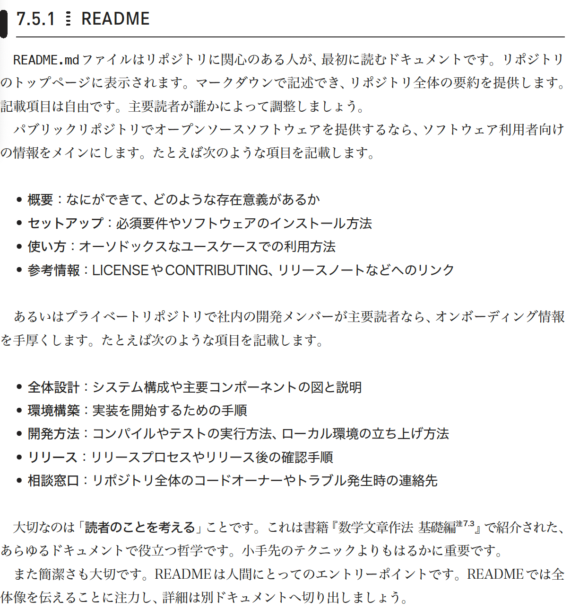

## タイムアウト
タイムアウトは常に設定する。
デフォルトだと6時間になるため、無限ループの際に気づかず6h消費する可能性がある

## README.md
• 概要：なにができて、どのような存在意義があるか
• セットアップ：必須要件やソフトウェアのインストール方法
• 使い方：オーソドックスなユースケースでの利用方法
• 参考情報：LICENSEやCONTRIBUTING、リリースノートなどへのリンク
　あるいはプライベートリポジトリで社内の開発メンバーが主要読者なら、オンボーディング情報
を手厚くします。たとえば次のような項目を記載します。
• 全体設計：システム構成や主要コンポーネントの図と説明
• 環境構築：実装を開始するための手順
• 開発方法：コンパイルやテストの実行方法、ローカル環境の立ち上げ方法
• リリース：リリースプロセスやリリース後の確認手順
• 相談窓口：リポジトリ全体のコードオーナーやトラブル発生時の連絡先
　大切なのは「読者のことを考える」ことです。これは書籍『数学文章作法 基礎編注7.3』で紹介された、
あらゆるドキュメントで役立つ哲学です。小手先のテクニックよりもはるかに重要です。
　また簡潔さも大切です。READMEは人間にとってのエントリーポイントです。READMEでは全
体像を伝えることに注力し、詳細は別ドキュメントへ切り出しましょう。
